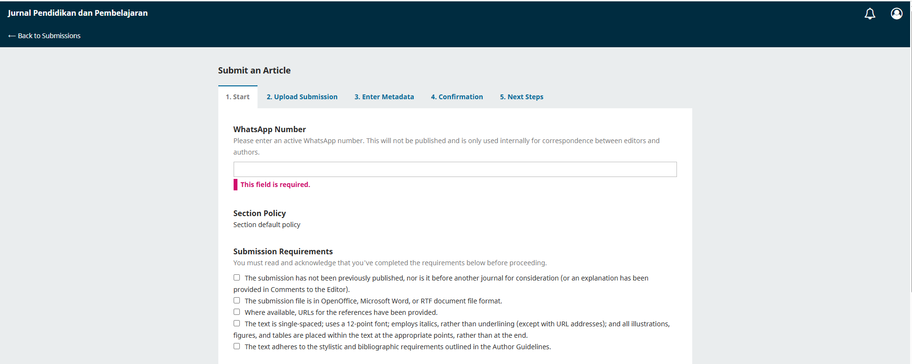
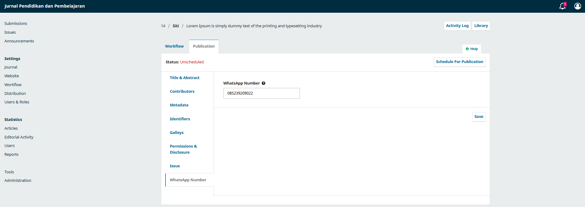

# WhatsApp Number Plugin for OJS
By KSJ

Plugin ini menambahkan field internal `Nomor WhatsApp` pada:

- langkah awal submission
- tab khusus `Publication > WhatsApp Number` di workflow editor

Nomor WhatsApp:

- wajib diisi saat submission
- hanya digunakan secara internal untuk korespondensi editor dan penulis
- tidak ditampilkan di frontend artikel
- tidak dimaksudkan sebagai metadata publik artikel

## Preview

### Form Submission

Tambahkan screenshot ke file `docs/preview-submission.png`

### Tab Workflow Editor

Tambahkan screenshot ke file `docs/preview-workflow.png`

## Struktur Penyimpanan

Penyimpanan utama menggunakan `submission_settings` dengan key `whatsappNumber`.

Plugin juga masih dapat membaca data lama dari `publication_settings` untuk kompatibilitas dan migrasi halus.

## Instalasi

### Cara 1. Dari Git / manual copy

1. Unduh plugin dari repository Git.
2. Jika yang diunduh berupa `.zip` dari Git, ekstrak terlebih dahulu.
3. Pastikan nama folder hasil ekstrak adalah `whatsappNumber`.
4. Salin folder `whatsappNumber` ke `plugins/generic/`
5. Masuk ke dashboard OJS.
6. Aktifkan plugin dari daftar plugin generic.
7. Hapus cache compile jika diperlukan.

### Cara 2. Instal lewat dashboard Plugin OJS

1. Siapkan paket plugin dalam format `.tar.gz`.
2. Pastikan isi arsip langsung berupa folder `whatsappNumber` beserta seluruh file plugin di dalamnya.
3. Masuk ke dashboard OJS.
4. Buka menu instal/upload plugin.
5. Upload file `.tar.gz` plugin.
6. Setelah proses instal selesai, aktifkan plugin.
7. Hapus cache compile jika diperlukan.

### Format paket yang kompatibel

- Untuk upload lewat dashboard OJS 3.3.0.22, gunakan format `.tar.gz`.
- File `.zip` cocok untuk distribusi dari Git atau unduhan manual, lalu diekstrak dan disalin ke folder plugin.

## Catatan

- Plugin ini diuji pada OJS versi `3.3.0.22`.
- Jika dipakai pada versi OJS yang berbeda jauh, mungkin perlu penyesuaian kecil.

## Author

By KSJ  
Email: koding.sil@gmail.com
